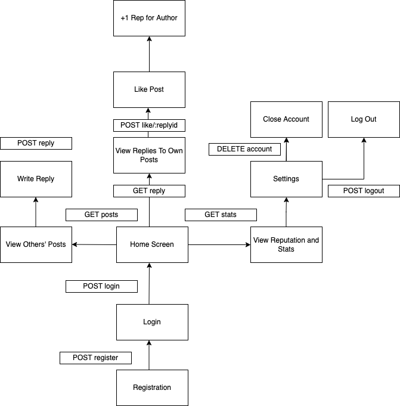

# Write Something Nice

Tech Stack:

- Client: Vue.js (TypeScript)
- REST API: FastAPI (Python), SQLAlchemy, Starlette + `pytest` (testing)
- Database: PostgreSQL
- Deployment: Linux VM (AWS EC2), NGINX, Gunicorn

## Introduction

Life is getting more stressful and isolated with the pandemic currently ongoing, and it's still very difficult and sometimes expensive to see a professional therapist. While this isn't meant to fill in that gap, it's always nice to have someone lend an ear without judgement. Write Something Nice is an app where users can reach out for help anonymously and good samaritans can write something nice to give them a hand. The goal of this app is to form just a little tiny bit more of empathy and human connection without the worry of exposing their personal information.

## Planning

The following is a sitemap used to map out the app's workflow.

It's a very simple CRUD application based around 4 database tables:

- User: A way for users to sign in and get access to their personal posts and write posts, replies, or likes.
- Post: The letter that users can anonymously write
- Reply: The reply sent by a different user about the Post.
- Like: A way for the Poster to thank the Replier and give them a reputation.

## Deployment

This API and PostgreSQL Database are currently hosted on a Linux virtual machine on AWS EC2.

## Usage

### Production

1. Make requests to `http://3.98.137.192/`

### Locally

1. Clone this repository.
2. `pip install -r requirements.txt`
3. Set up environment variables according to the Pydantic schema in `config.py`.
4. `uvicorn app.main:app`

## Documentation

Visit the [Documentation Page](http://3.98.137.192/docs) for this project on FastAPI Swagger Docs.
